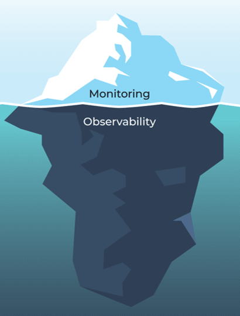

<!-- paginate: skip -->

# 관측가능성(Observability)이란 무엇인가?

---

<!-- paginate: true -->

## Speaker

이윤성

- x-System Engineer in IDC
- x-DevOps Engineer in payments
- DevOps Engineer in exchange

---

모니터링의 새로운 미래 관측 가능성

---

## Site Reliability Engineer

availability, latency, performance, efficiency
change management, monitoring, emergency response, and capacity planning

<!--
전자상거래 플랫폼을 구동하는 복잡한 마이크로서비스 아키텍처가 있다고 가정해 보겠습니다. 모니터링 도구는 높은 CPU 사용률이나 과도한 메모리 소비와 같은 알려진 문제를 부지런히 감시해 왔습니다. 하지만 고객으로부터 느린 체크아웃에 대한 불만이 접수되기 시작했고, 모니터링 도구는 아무런 경고도 트리거하지 않았습니다.

관찰 가능성을 통해 시스템을 더 깊이 파헤칩니다. 결제 서비스가 특정 거래에 대해 때때로 상당한 지연을 겪고 있다는 것을 알게 됩니다. 원격 측정 데이터를 통해 이러한 지연이 트래픽 급증 시 외부 결제 게이트웨이 시간 초과로 인해 발생한다는 것을 알게 됩니다. 이는 명시적으로 모니터링되지 않는 시나리오입니다.

이 새롭게 얻은 지식을 무장하고, 외부 서비스 문제를 우아하게 처리하기 위한 적응형 전략을 구현하여 고객에게 더 매끄러운 쇼핑 경험을 보장합니다. 알려지지 않은 미지의 문제를 해결하기 위한 이러한 사전 예방적 접근 방식은 관찰 가능성의 핵심 강점입니다.
-->

---

## 대규모 시스템 관리의 필요성

Kubernetes에 올라가는 수천 개의 컨테이너 어플리케이션은 거대하고 복잡함

---

## 관측가능성(Observability)의 개념

시스템의 내부 상태를 외부에서 측정 가능한 데이터(로그, 메트릭, 트레이싱)를 통해 파악하는 능력.

단순한 모니터링을 넘어, **왜** 문제가 발생했는지 파악하는 데 중점.

---

### 모니터링과 관측가능성의 차이

**모니터링**: 시스템의 현재 상태 추적.

**관측가능성**: 예측하지 못한 문제를 이해하고 해결.

---

## 왜 관측가능성이 중요한가?

- **복잡한 시스템에서의 관측가능성**:
  - 마이크로서비스, 클라우드 네이티브 아키텍처, 쿠버네티스 환경에서 필요.
  - 복잡한 상호작용으로 인해 **관측가능성** 필수.

- **SRE에서의 관측가능성 역할**:
  - 시스템 안정성과 성능 유지.
  - 문제 예측 및 대응을 지원.

---

### 관측가능성의 세 가지 핵심 요소

Log, Trace, Metric

---

### 로그(Log)

- 시스템 이벤트 기록.
- 문제 발생 시 중요한 정보 제공.
- **Promtail**: 다양한 소스의 로그 수집 도구.

---

### 메트릭(Metric)

- 시스템 성능 데이터.
- **Prometheus**: 메트릭 수집과 시각화.
- 시스템 자원 사용량 및 트렌드 분석.

---

### 트레이스(Trace)

- 서비스 간 요청 흐름 추적.
- **Jaeger**, **OpenTelemetry**: 분산 시스템의 성능 문제 파악.

---

## 관측가능성 도구의 예시

- **Prometheus와 Grafana**: 메트릭 수집과 시각화 도구.
- **Promtail과 Loki**: 로그 수집 및 분석 도구.
- **Jaeger와 OpenTelemetry**: 트레이싱 및 로그, 메트릭 통합.

---

## 관측가능성 설계 시 고려 사항

- **데이터 수집 및 저장 비용**:
  - Loki는 비용 효율적 로그 관리 가능.
  
- **시스템 성능과 관측가능성의 균형**:
  - 관측가능성 도입 시 성능 저하 최소화 필요.

---

## SRE와 관측가능성의 연관성

- **SLO와 관측가능성**:
  - SLO 달성 위한 필수 도구.
  - 문제 미리 감지, 대응.

- **Incident Response**:
  - 실시간 로그, 메트릭 분석으로 문제 해결 시간 단축.

---

## CNCF

**26** Graduated, **36** Incubating, **123** Sandbox

오픈소스로 관측가능성을 점진적으로 확보해나가는 일

---

## 관측가능성의 발전 방향

- **AIOps와 관측가능성**:
  - 머신러닝을 통한 로그, 메트릭, 트레이싱 데이터 분석.
  - 예측적 유지보수와 자동화된 대응.

- **통합 플랫폼**:
  - OpenTelemetry와 같은 프레임워크로 통합적 데이터 관리.

---

## 관측가능성의 필수성

- **관측가능성은 필수적**:
  - 현대 시스템에서는 선택이 아닌 필수.
  - **Prometheus, Loki, Grafana** 도구들이 이를 구현하는 데 효과적.

---

<!-- paginate: skip -->

## Reference

- [사이트 신뢰성 엔지니어](https://www.codestates.com/blog/content/사이트-신뢰성-엔지니어)
- [SRE Resources](https://sre.xyz/)
- [Google SRE Book](https://sre.google/sre-book/foreword/)

---

## Free ebook

[SRE Books by Google](https://sre.google/books/)

