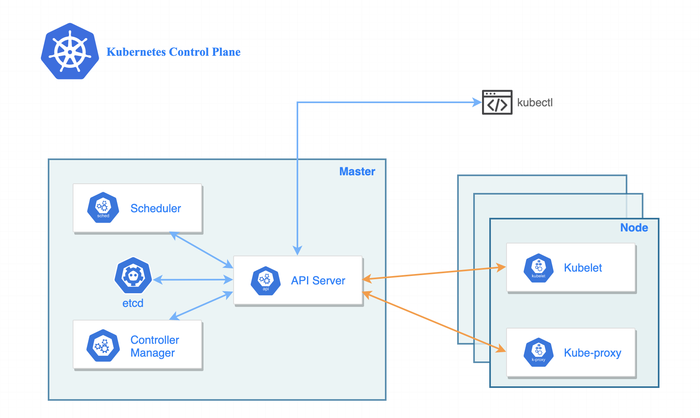

# Kubernetes Core

- **난이도**: 초급
- **예상 소요 시간**: 10분

&nbsp;

이 시나리오의 목표는 minikube를 사용하여 로컬 환경에 Kubernetes 클러스터를 배포하는 것입니다.

&nbsp;

## 1단계 - 클러스터 생성

패키지 매니저인 [brew](https://brew.sh/)를 사용해서 로컬 환경에 도커 데스크탑을 먼저 설치합니다.

```bash
brew install docker --cask
```

Kubernetes → Enable kubernetes 체크 → Apply & restart 클릭


아직 설치하지 않았다면 먼저 `minikube`와 `kubectl` 패키지를 설치합니다.

```bash
brew install minikube kubectl
```

`minikube version` 명령을 실행하여 제대로 설치되었는지 확인하세요.

```bash
minikube version
```

3대의 노드로 구성된 minikube 클러스터를 생성합니다.

```bash
minikube start \
    --driver='docker' \
    --profile='multinode-lab' \
    --cni='calico' \
    --kubernetes-version='stable' \
    --nodes=3
```

Kubernetes 클러스터는 두 가지 유형의 리소스로 구성됩니다. 컨트롤 플레인<sup>Control Plane</sup>은 클러스터를 조정합니다. 노드<sup>Nodes</sup>는 애플리케이션 파드를 실행하는 작업자입니다.



컨트롤플레인 1대, 워커노드가 2대 생성됩니다.

```console
$ kubectl get node
NAME                STATUS   ROLES           AGE     VERSION
multinode-lab       Ready    control-plane   3h37m   v1.31.0
multinode-lab-m02   Ready    <none>          3h36m   v1.31.0
multinode-lab-m03   Ready    <none>          3h36m   v1.31.0
```


&nbsp;

## 2단계 - 클러스터 살펴보기

클러스터 정보를 확인해보겠습니다. 이를 위해 `kubectl cluster-info` 명령어를 실행합니다:

```bash
kubectl cluster-info
```

이 명령어는 클러스터의 기본 정보를 출력합니다.

```bash
Kubernetes control plane is running at https://127.0.0.1:57801
CoreDNS is running at https://127.0.0.1:57801/api/v1/namespaces/kube-system/services/kube-dns:dns/proxy

To further debug and diagnose cluster problems, use 'kubectl cluster-info dump'
```

클러스터의 API 서버와 다른 서비스의 URL을 확인할 수 있으며, 클러스터가 정상적으로 작동하는지 점검하는 데 유용합니다. 이 정보를 통해 쿠버네티스 클러스터에 접근할 수 있는지를 확인할 수 있습니다.

이제 클러스터에 있는 노드를 확인해보겠습니다. 이를 위해 `kubectl get nodes` 명령어를 실행합니다:

```bash
kubectl get nodes -o wide
```

이 명령어는 클러스터 내의 모든 노드를 나열합니다. 각 노드의 이름, 상태, 역할 등을 보여줍니다. 현재 클러스터에는 3개의 노드가 있으며, 이 노드의 상태가 `Ready`로 표시됩니다. `Ready` 상태는 해당 노드가 애플리케이션을 호스팅할 준비가 되어 있음을 의미합니다.

```bash
NAME                STATUS   ROLES           AGE     VERSION   INTERNAL-IP    EXTERNAL-IP   OS-IMAGE             KERNEL-VERSION    CONTAINER-RUNTIME
multinode-lab       Ready    control-plane   5h36m   v1.31.0   192.168.49.2   <none>        Ubuntu 22.04.4 LTS   6.10.0-linuxkit   docker://27.2.0
multinode-lab-m02   Ready    <none>          5h35m   v1.31.0   192.168.49.3   <none>        Ubuntu 22.04.4 LTS   6.10.0-linuxkit   docker://27.2.0
multinode-lab-m03   Ready    <none>          5h35m   v1.31.0   192.168.49.4   <none>        Ubuntu 22.04.4 LTS   6.10.0-linuxkit   docker://27.2.0
```

이 정보를 통해 클러스터의 자원을 확인하고 애플리케이션 배포를 위한 준비 상태를 점검할 수 있습니다.
