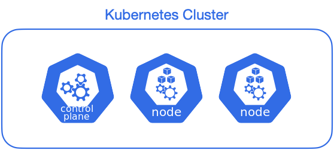

# 모듈 2 - 앱 배포하기

- **난이도**: 초급
- **예상 소요 시간**: 10분

&nbsp;

이 시나리오의 목표는 kubectl을 사용하여 Kubernetes에 첫 번째 애플리케이션을 배포하는 방법을 배우는 것입니다. 이를 통해 kubectl CLI의 기본 사항과 애플리케이션과 상호 작용하는 방법을 익히게 됩니다.

## 1단계 - kubectl 기본 사항

터미널에 kubectl을 입력하여 사용법을 확인하세요. kubectl 명령의 일반적인 형식은 다음과 같습니다: kubectl action resource. 이것은 지정된 작업(예: create, describe)을 지정된 리소스(예: node, container)에 수행합니다. 명령어 뒤에 --help를 붙이면 가능한 매개변수에 대한 추가 정보를 얻을 수 있습니다(kubectl get nodes --help).

클러스터와 연결된 kubectl이 구성되어 있는지 확인하려면 다음 명령을 실행하세요:

```bash
kubectl version
```

이 명령을 통해 kubectl이 설치되었고, 클라이언트 및 서버 버전을 모두 확인할 수 있습니다.

클러스터의 노드를 보려면 `kubectl get nodes` 명령을 실행하세요:

```bash
kubectl get nodes
```

여기서 사용 가능한 노드(우리의 경우 1개)를 확인할 수 있습니다. Kubernetes는 노드의 가용 리소스를 기반으로 애플리케이션을 배포할 위치를 결정합니다.

&nbsp;

## 2단계 - 애플리케이션 배포

**네임스페이스 생성**  
우리는 먼저 bootcamp라는 네임스페이스를 생성하여, 해당 네임스페이스에서 애플리케이션을 배포하고 관리하겠습니다. 네임스페이스는 Kubernetes 내에서 리소스를 격리하여 관리할 수 있는 논리적 단위입니다.

다음 명령으로 bootcamp 네임스페이스를 생성하세요:

```console
kubectl create namespace bootcamp
kubectl get namespace
```

**애플리케이션 배포**
이제 bootcamp 네임스페이스에 애플리케이션을 배포합니다. `kubectl create deployment` 명령을 사용할 때, `--namespace=bootcamp` 옵션을 추가하여 해당 네임스페이스를 지정합니다.

```bash
kubectl create deployment kubernetes-bootcamp \
  --image=gcr.io/k8s-minikube/kubernetes-bootcamp:v1 \
  --namespace bootcamp
```

이렇게 하면 애플리케이션이 bootcamp 네임스페이스에 배포됩니다.

```bash
deployment.apps/kubernetes-bootcamp created
```

이 작업은 다음과 같은 몇 가지 작업을 수행했습니다:

- 애플리케이션이 실행될 수 있는 적합한 노드를 검색했습니다(사용 가능한 노드는 3개)
- 해당 노드에서 애플리케이션을 실행하도록 스케줄링했습니다
- 필요에 따라 인스턴스를 새로운 노드에 다시 스케줄링하도록 클러스터를 구성했습니다

배포 목록을 확인하려면 `--namespace=bootcamp` 옵션을 사용해 bootcamp 네임스페이스의 리소스를 조회합니다:

배포 목록을 보려면 `get deployments` 명령을 사용하세요:

```bash
# Short command
kubectl get deploy -n bootcamp

# Full command
kubectl get deployments --namespace=bootcamp
```

애플리케이션의 인스턴스가 노드의 Docker 컨테이너 내부에서 실행 중인 1개의 배포가 있음을 확인할 수 있습니다.

&nbsp;

## 3단계 - 파드 수 확장

배포된 애플리케이션의 파드 수를 확장해 보겠습니다. kubectl scale deployment 명령을 사용하여 현재 실행 중인 파드 수를 늘릴 수 있습니다.

파드 수를 3개로 확장하려면 다음 명령을 실행하세요:

```console
$ kubectl scale deployment kubernetes-bootcamp --replicas=3 -n bootcamp
NAME                                   READY   STATUS    RESTARTS   AGE
kubernetes-bootcamp-69ff4c7fd7-2m4gg   1/1     Running   0          25s
kubernetes-bootcamp-69ff4c7fd7-b88r5   1/1     Running   0          77s
kubernetes-bootcamp-69ff4c7fd7-s8lnl   1/1     Running   0          25s
```

이 명령은 kubernetes-bootcamp 배포의 파드 수를 3개로 늘립니다.

```bash
deployment.apps/kubernetes-bootcamp scaled
```

확장이 완료되었는지 확인하려면 kubectl get pods 명령으로 파드 목록을 확인하세요:

```bash
kubectl get pods -n bootcamp
```

3개의 파드가 실행 중인 것을 확인할 수 있습니다.

이제 파드 수를 5개로 확장해 보겠습니다:

```bash
kubectl scale deployment kubernetes-bootcamp --replicas=5
```


다시 한 번 파드 상태를 확인하여 5개의 파드가 실행 중인지 확인하세요:

```console
$ kubectl get pods -n bootcamp
NAME                                   READY   STATUS    RESTARTS   AGE
kubernetes-bootcamp-69ff4c7fd7-2m4gg   1/1     Running   0          51s
kubernetes-bootcamp-69ff4c7fd7-b88r5   1/1     Running   0          103s
kubernetes-bootcamp-69ff4c7fd7-n2vmm   1/1     Running   0          2s
kubernetes-bootcamp-69ff4c7fd7-qbqv2   1/1     Running   0          2s
kubernetes-bootcamp-69ff4c7fd7-s8lnl   1/1     Running   0          51s
```

&nbsp;

## Kubernetes 운영 철학: 확장성과 자가 치유(Self-healing)

Kubernetes는 애플리케이션의 운영과 관리를 자동화하는 데 중점을 둔 플랫폼입니다. 그중 핵심 개념은 확장성과 자가 치유(Self-healing)입니다. 파드 수를 확장하는 방식도 이러한 철학을 반영하고 있습니다.



&nbsp;

**1. 확장성**:  
Kubernetes는 수평적 확장을 통해 애플리케이션의 트래픽 부하를 효과적으로 분산합니다. 애플리케이션에 대한 트래픽이 증가하거나 성능 요구 사항이 커질 때, kubectl scale 명령을 사용하여 파드 수를 늘릴 수 있습니다. 이러한 확장 작업은 쉽게 관리 가능하며, 사용자는 필요에 따라 언제든지 리소스를 조정할 수 있습니다.

예를 들어, 트래픽이 몰리는 특정 시간대에는 더 많은 파드를 생성하고, 한가한 시간대에는 파드를 줄여 리소스를 효율적으로 관리할 수 있습니다. 이는 자동 확장(Horizontal Pod Autoscaling, HPA) 기능과도 연결됩니다. HPA는 CPU 사용량 등 리소스 소비량을 모니터링하여 자동으로 파드 수를 조정합니다.

&nbsp;

**2. 자가 치유(Self-healing)**:  
Kubernetes의 가장 강력한 기능 중 하나는 자가 치유 능력입니다. 클러스터 내에서 파드가 오류를 일으키거나 노드가 비정상 상태가 되면 Kubernetes는 자동으로 새로운 파드를 생성하여 해당 애플리케이션이 항상 가용 상태를 유지할 수 있도록 보장합니다. kubectl scale 명령을 통해 파드 수를 조정하더라도 Kubernetes는 사용자가 지정한 상태(desired state)를 유지하기 위해 필요한 작업을 자동으로 처리합니다.

예를 들어, 5개의 파드를 실행 중인 상태에서 그중 하나가 실패하면, Kubernetes는 이 상황을 감지하고 즉시 새로운 파드를 생성하여 사용자가 요청한 파드 수를 유지합니다.

&nbsp;

이러한 철학 덕분에 Kubernetes는 클러스터 관리자가 최소한의 개입으로도 안정적이고 확장 가능한 애플리케이션 운영을 가능하게 합니다.

&nbsp;

## 정리

이제 네임스페이스라는 Kubernetes의 논리적 단위를 통해 리소스를 격리하고 관리하는 방법을 학습했습니다. bootcamp 네임스페이스에서 애플리케이션을 배포하고, Kubernetes의 확장성 및 자가 치유 개념을 기반으로 파드 수를 동적으로 관리하는 방법을 이해하게 되었습니다.
