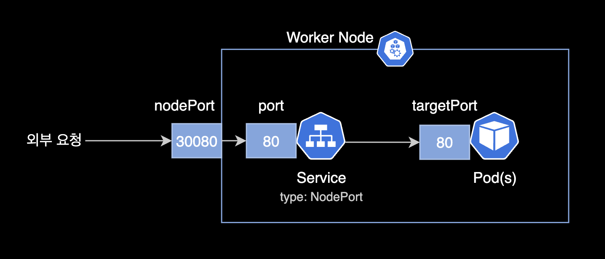

# 모듈 3 - 앱 외부로 노출하기

- **난이도**: 초급
- **예상 소요 시간**: 10분

&nbsp;

이 시나리오에서는 `kubectl expose` 명령을 사용하여 Kubernetes 클러스터 외부에서 애플리케이션을 노출하는 방법을 배웁니다. 또한 `kubectl label` 명령을 사용해 오브젝트에 라벨을 조회하고 적용하는 방법을 익히게 됩니다.

&nbsp;

## 1단계 - 새로운 서비스 생성

먼저 애플리케이션이 정상적으로 실행 중인지 확인해 봅시다. kubectl get 명령을 사용하여 현재 실행 중인 파드를 확인합니다:

```bash
kubectl get pods -n bootcamp
```

다음으로 클러스터에서 현재 서비스들을 확인해 보겠습니다:

```bash
kubectl get services -n bootcamp
```

기본적으로 minikube가 클러스터를 시작할 때 Kubernetes라는 서비스가 생성됩니다. 이제 새로운 서비스를 생성하고 외부 트래픽에 노출하기 위해 expose 명령을 사용하겠습니다. 이때 NodePort 유형을 지정하여 노출합니다:

```bash
kubectl expose deployment/kubernetes-bootcamp \
  -n bootcamp --type="NodePort" --port 8080
```

이제 다시 get services 명령을 실행하여 새로운 서비스를 확인해 보겠습니다:

```bash
kubectl get services -n bootcamp
```

Docker Desktop 사용자 참고: Docker Desktop의 네트워킹 제한으로 인해 기본적으로 호스트에서 파드에 직접 접근할 수 없습니다. 이 경우 `minikube service kubernetes-bootcamp` 명령을 실행하면 파드에서 호스트로 SSH 터널을 생성하고, 서비스에 연결된 브라우저 창이 열립니다. 터널은 Ctrl+C를 눌러 종료할 수 있으며, 이후 2단계로 계속 진행하세요.

이제 kubernetes-bootcamp라는 새로운 서비스가 실행 중입니다. 이 서비스는 고유한 클러스터 IP, 내부 포트 및 외부 IP(Node의 IP)를 할당받았습니다.

> [!NOTE]
> **Kubernetes의 Service 개념**  
> Kubernetes에서 서비스(Service)는 파드에 접근할 수 있는 네트워크 엔드포인트를 제공합니다. 서비스는 클러스터 내부와 외부 모두에서 트래픽을 라우팅할 수 있으며, 클러스터 IP, NodePort, LoadBalancer 등 다양한 유형으로 설정할 수 있습니다. 여기서 우리는 NodePort를 사용하여 클러스터 외부에서 접근 가능하도록 설정했습니다.

**NodePort 타입의 service 구성 예시**:  



&nbsp;

이제 외부에 노출된 포트를 확인하기 위해 describe service 명령을 실행해 보겠습니다:

```bash
kubectl describe services/kubernetes-bootcamp -n bootcamp
```

노출된 NodePort 값을 저장하기 위해 환경 변수를 설정합니다:

```bash
export NODE_PORT=$(kubectl get services/kubernetes-bootcamp -o go-template='{{(index .spec.ports 0).nodePort}}' -n bootcamp)
echo NODE_PORT=$NODE_PORT
```

이제 `curl` 명령을 사용해 Node의 IP와 외부에 노출된 포트로 애플리케이션에 접근할 수 있습니다:

```bash
curl $(minikube ip -p multinode-lab):$NODE_PORT
```

서버로부터 응답을 받습니다. 즉, 서비스가 외부로 노출되었습니다.

&nbsp;

## 2단계 - 라벨 붙이기

Deployment가 자동으로 파드에 라벨을 생성했습니다. `describe deployment` 명령을 사용하여 이 라벨의 이름을 확인할 수 있습니다:

```bash
kubectl describe deployment -n bootcamp
```

> [!NOTE]
> **Kubernetes의 라벨(Label) 개념**  
> 라벨은 Kubernetes에서 오브젝트(예: 파드, 서비스 등)를 식별하는 데 사용되는 키-값 쌍입니다. 이를 통해 개발자는 파드를 그룹화하고, 특정 라벨을 기준으로 선택할 수 있습니다. 라벨은 배포, 스케줄링, 모니터링 등 다양한 작업에서 유용하게 사용됩니다.

이 라벨을 사용해 파드 목록을 조회해 보겠습니다. -l 매개변수를 사용하여 라벨 값을 지정합니다:

```bash
kubectl get pods -l app=kubernetes-bootcamp -n bootcamp
```

같은 방식으로 서비스 목록도 조회할 수 있습니다:

```bash
kubectl get services -l app=kubernetes-bootcamp -n bootcamp
```

파드 개수를 5개에서 1개로 축소합니다.

```bash
kubectl scale deployment kubernetes-bootcamp --replicas=1 -n bootcamp
```

`bootcamp` 네임스페이스에 있는 파드의 이름을 수집하여 `POD_NAME` 환경 변수에 저장한 후, 그 값을 터미널에 출력하는 작업을 수행합니다.

```bash
export POD_NAME=$(kubectl get pods -n bootcamp -o go-template --template '{{range .items}}{{.metadata.name}}{{"\n"}}{{end}}')
echo Name of the Pod: $POD_NAME
```

새로운 라벨을 적용하려면 `label` 명령을 사용하고, 오브젝트 유형, 오브젝트 이름 및 새 라벨을 지정합니다:

```bash
kubectl label pods $POD_NAME version=v1 -n bootcamp
```

이 명령은 파드에 새로운 라벨을 적용합니다. 이제 `describe pod` 명령으로 라벨이 제대로 적용되었는지 확인해 봅시다:

```bash
kubectl describe pods $POD_NAME -n bootcamp
```

파드에 라벨이 추가된 것을 확인할 수 있습니다. 이제 새로운 라벨을 사용하여 파드 목록을 조회할 수 있습니다:

```bash
kubectl get pods -l version=v1 -n bootcamp
```

그리고 해당 파드를 확인할 수 있습니다.

&nbsp;

## 3단계 - 서비스 삭제

서비스를 삭제하려면 delete service 명령을 사용합니다. 라벨을 기준으로 삭제할 수도 있습니다:

```bash
kubectl delete service -l app=kubernetes-bootcamp -n bootcamp
```

`service` 리소스가 삭제되었는지 확인합니다:

```bash
kubectl get services -n bootcamp
```

이제 서비스가 삭제되었음을 확인할 수 있습니다. 이전에 노출된 IP와 포트에 대해 `curl` 명령을 실행해 봅시다:

```bash
curl $(minikube ip):$NODE_PORT
```

애플리케이션이 더 이상 클러스터 외부에서 접근할 수 없다는 사실을 확인할 수 있습니다. 그러나 파드 내부에서는 여전히 애플리케이션이 실행 중입니다. 이를 확인하기 위해 파드 내부에서 curl 명령을 실행합니다:

```bash
kubectl exec -n bootcamp -it $POD_NAME -- curl localhost:8080
```

애플리케이션이 여전히 실행 중인 것을 확인할 수 있습니다.

```bash
Hello Kubernetes bootcamp! | Hostname: kubernetes-bootcamp-b5bd44ff6-w2kkk | v=2
```

이는 Deployment가 애플리케이션을 관리하고 있기 때문입니다. 애플리케이션을 완전히 종료하려면 배포(Deployment)도 삭제해야 합니다.

> [!NOTE]
> **Kubernetes의 자가 치유(Self-Healing) 철학**  
> Kubernetes는 자가 치유 기능을 통해 파드가 비정상적으로 종료되거나 삭제되었을 때, 배포나 ReplicaSet에서 자동으로 파드를 다시 생성하여 애플리케이션이 지속적으로 실행되도록 보장합니다. 이 철학은 Kubernetes의 핵심 개념 중 하나로, 시스템 가용성과 안정성을 극대화하는 데 기여합니다.

&nbsp;

## 정리

이 시나리오를 통해 Kubernetes 클러스터 외부로 애플리케이션을 노출하고, 라벨을 사용하여 리소스를 관리하는 방법을 배웠습니다.
